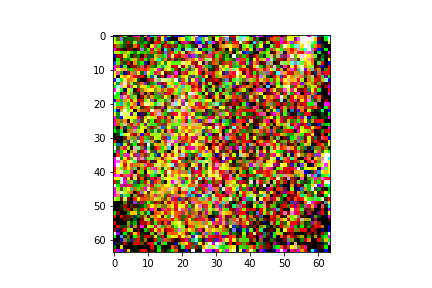

# Test_Problem

## Task 1. Diffusion Model

To see results of the inference of the model, do the following:

1. add a shortcut of the [weights folder](https://drive.google.com/drive/folders/1d9T0Y8p6iVE902KW82cs-pe2Egk-qdN4?usp=sharing) to the Google Disk
2. open `Burnaev_lab_task_1.ipynb` notebook in Google Colab
3. go to the Test part 
4. Inside variable `PATH_TO_WEIGHTS` put your real path to the weight folder in Google Dist 
5. run all cells below Test header

Inside weight folder there are two files:
1. `ddpm_floodnet_short.pth` - weights of trained DDPM model on 20% of FloodNet Dataset.
2. `ddpm_floodnet.pth`- weights of trained DDPM model on 100% of FloodNet Dataset.

<p align="center">
  
  
</p>
<p align="center">   
   <em> Fig.1 Results of the DDPM on FloodNet dataset </em>
</p>


## Task 2. Graphs

`graph.py` - consists of class Graph and Vertex. Class Graph has the following methods:
- А. Adding a node with some information.
- Б. Adding an edge between two nodes;
- B. Generating a random graph;
- Г. Drawing the resulting graph with matplotlib.

`invitation_list.py` - creates random graph, plot and saves it and creates the most optimal guest list regarding the following problem:

> You choose from a group of N friends with whom to go on a picnic. However, the friends connected by an edge in the graph are in a very unfriendly relationship with each other, so if they both go on the picnic, it will be spoiled. In order to have as many friends as possible at the picnic. as many friends as possible, who should be invited?

To run the `invitation_list.py`, do the following:

```
python invitation_list.py
```

<p align="center">
  
</p>
<p align="center">   
   <em> Fig.2 Result of the "invitation_list.py" algorithm </em>
</p>

To test the algorithm run `Burnaev_lab_task_2.ipynb` file, which runs it 10 times and print results of each 10 experiment. 

## Task 3. Bash and Docker

`script_task3_1.sh` - count how many times each word occurs in the file. The result of the count is displayed on the screen.
`script_task3_2.sh` - takes the 10 most common words and create empty files with their names <word_number>.

To run the first script on bash, do the following:
```
bash script_task3_1.sh
```

To run second script on bash, do the following:

```
bash script_task3_2.sh $filename $output
```
where `filename` - path to the file where we count the 10 most common words, `output` - name of the directory where all created files will be saved.

`dracura.txt` - sample file, which can be used to test correctness of above bash scripts.

To run both scripts inside Docker container, you need to have `Dockerfile` and put in in the same directory as `dracura.txt`, `script_task3_1.sh` and `script_task3_2.sh`. Then run the following commands:

```
docker pull ubuntu
docker build -t "count_words" . # build an image
docker run -it count_words bash # build a container 

```
Then open new terminal, and run the following:
```
docker ps # find container id
docker exec <CONTAINER ID> bash script_task3_1.sh
docker exec <CONTAINER ID> bash script_task3_2.sh dracula.txt result
```
